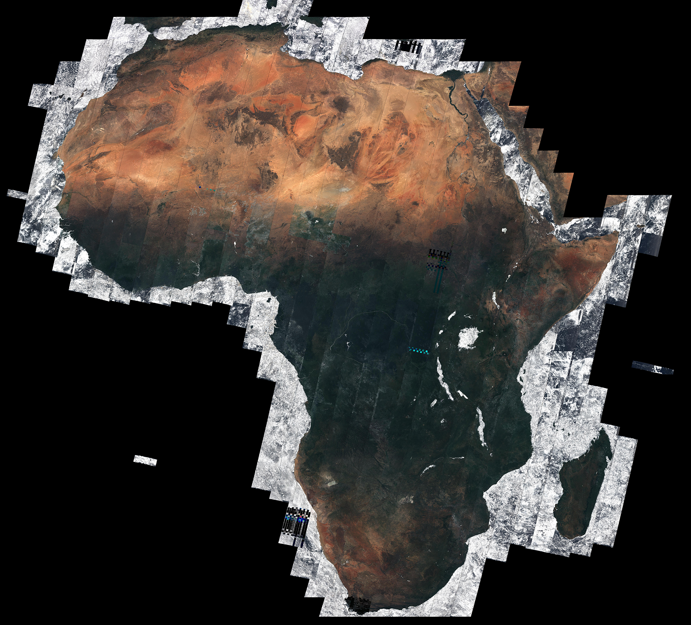
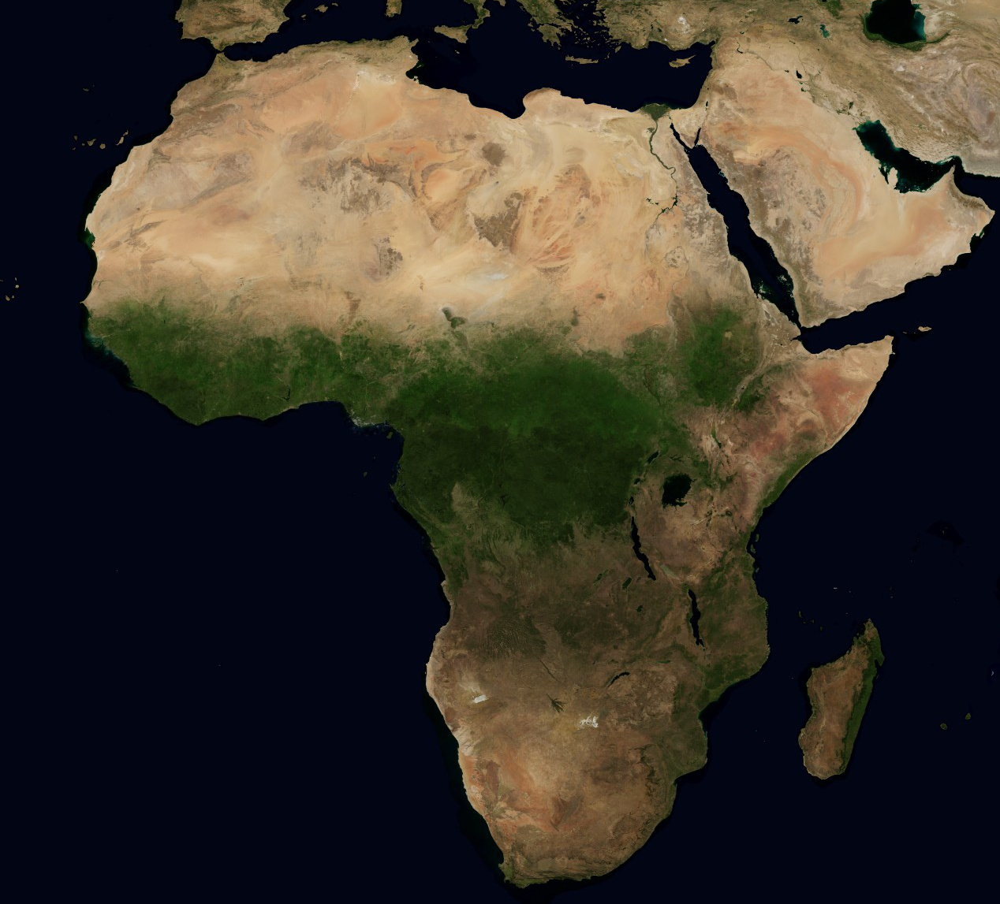
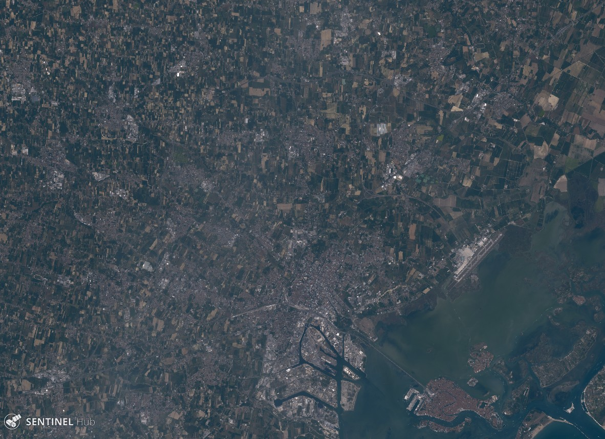

# Natural color representation of Sentinel-2 data

This repository contains supplementary material for our paper [_Natural color representation of Sentinel-2 data_](http://arxiv.org/...).

## Introduction

The true color image---defined as an image that strives to offer a natural color rendition of a scene---is one of the most widely used [Earth observation](https://en.wikipedia.org/wiki/Earth_observation) products. In the context of satellite imagery, the true color should represent spectral responses of the satellite bands so as to match the color perceived by the human eye. However, most true color satellite products fail to achieve this.

When it comes to [Sentinel-2](https://sentinel.esa.int/web/sentinel/missions/sentinel-2)---an optical mission part of [European Space Agency](http://www.esa.int/ESA)'s [Copernicus Program](http://www.esa.int/Our_Activities/Observing_the_Earth/Copernicus)---the state-of-the-art true color products map [Sentinel-2 MSI](https://earth.esa.int/web/sentinel/technical-guides/sentinel-2-msi/msi-instrument) bands B4, B3, and B2 directly to [sRGB](https://en.wikipedia.org/wiki/SRGB) components R, G, and B, respectively (sometimes with additional gain and gamma corrections in the sRGB space). This results in images with overly saturated and sometimes unrealistic colors.


<!--
The images below illustrate this. On the left is a true color composite of Africa, taken from [ESA Space in Images](http://www.esa.int/spaceinimages/Images/2016/05/African_mosaic); on the right is the same scene processed by NASA from MODIS data.

African mosaic                                 | NASA Blue Marble
:------------------------------------------------:|:----------------:
 (c) ESA; Brockmann Consult; Université catholique de Louvain              |  (c) NASA
-->

Our key contributions are threefold.
1. In this work we define a _natural color product_ as the product that approximates the color that the human eye would sense from Sentinel-2 responses and propose two computationally efficient approaches for computing the natural color.
2. We argue that one should use the [non-linear sRGB transfer function](https://en.wikipedia.org/wiki/SRGB#The_sRGB_transfer_function_.28.22gamma.22.29) when encoding digital images; we find that most satellite images on the web as well as numerous image processing platforms fail to take this into account.
3. As a side note, we recommend that levels adjustment be performed in color spaces where color's visual characteristics that one is improving are represented independently of each other.

The images below showcase the default true color (left) and the natural color (right) that we propose in our work.

True color | Natural color
:---------:|:-------------:
 Carrizo Plain National Monument |  Carrizo Plain National Monument
 Izmir, Turkey |  Izmir, Turkey
 Amposta, Spain |  Amposta, Spain
 Venice, Italy |  Venice, Italy

## Interactive examples

You can try out the algorithms we've proposed via [Sentinel Playground](apps.sentinel-hub.com/sentinel-playground/) and [EO Browser](apps.sentinel-hub.com/eo-browser/) applications which run atop our interactive [Sentinel-Hub](http://sentinel-hub.com/) platform.

All natural-color algorithms have been implemented as ready-to-use custom scripts (under `./scripts/`) that you can copy-and-paste into Sentinel Playground and/or EO Browser. Needless to say, you can also fiddle with the code!

For convenience we've collected the algorithms into a table with links where you can view them interactively in Sentinel Playground and/or EO Browser.

### List of procedures

Shorthand descriptions | URL
:---------------------:|:---------------------:|


## Gallery
TODO

## Citing
BibTeX:
```
TODO
```
