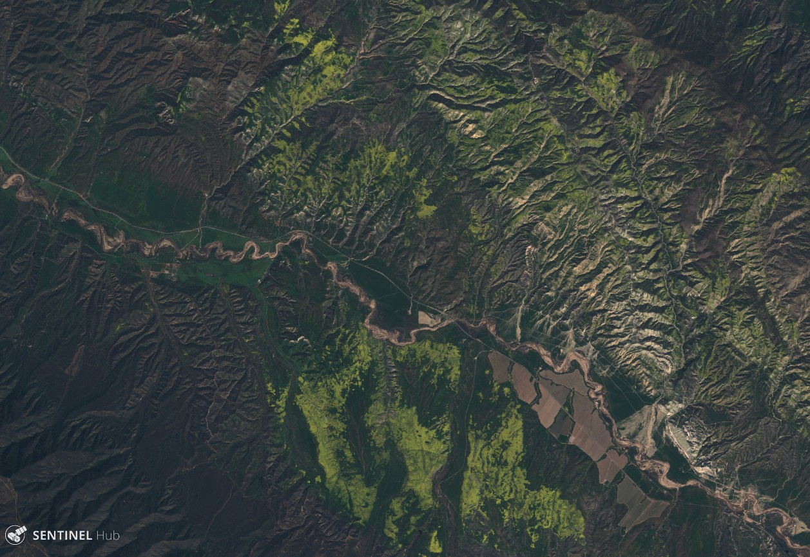
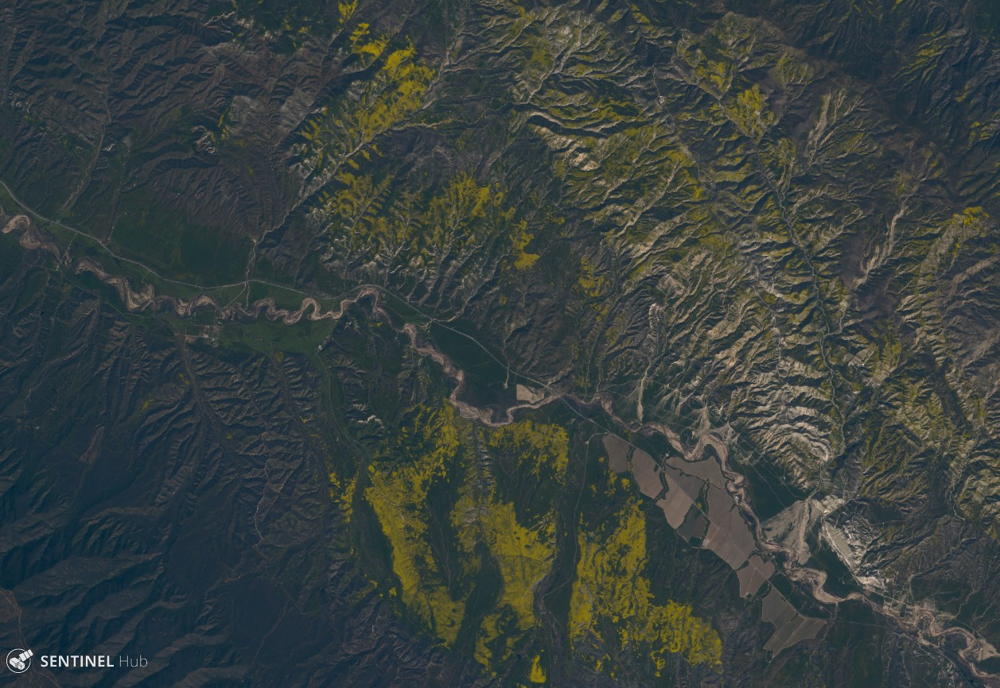
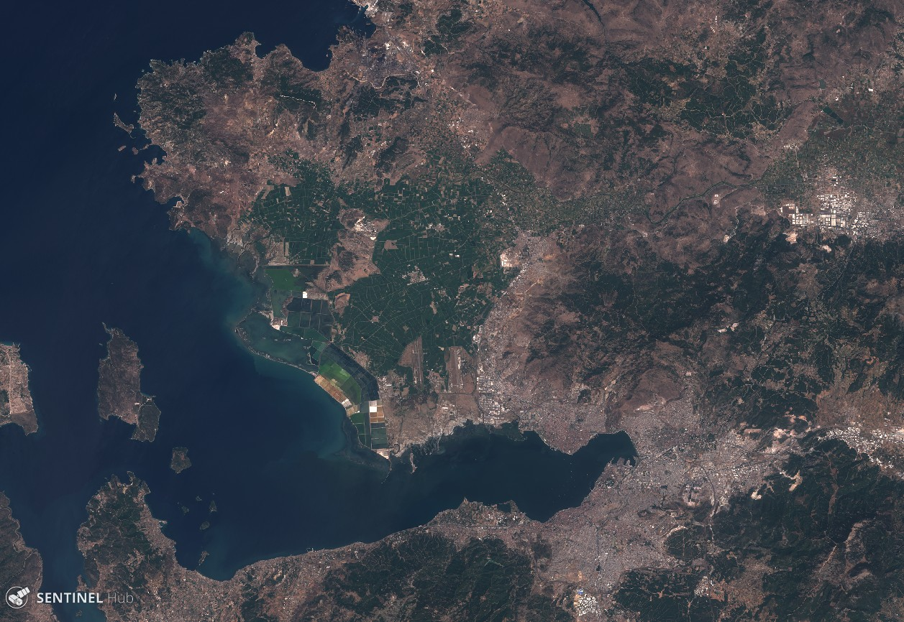
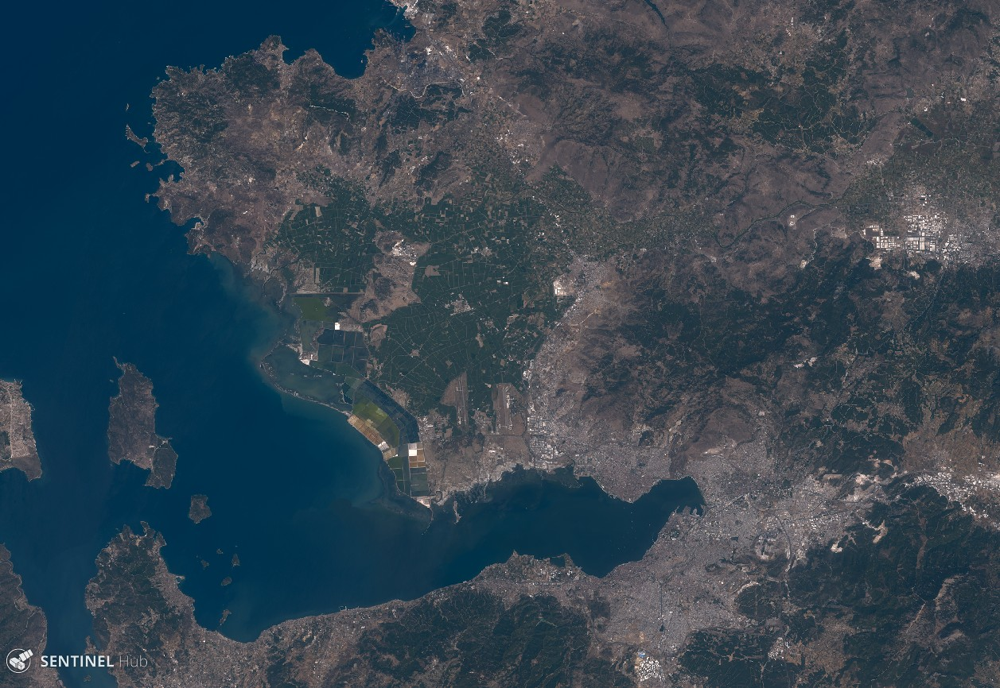
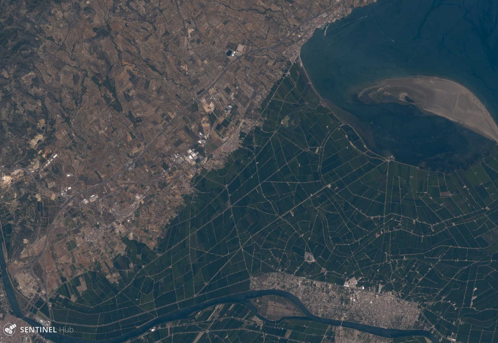
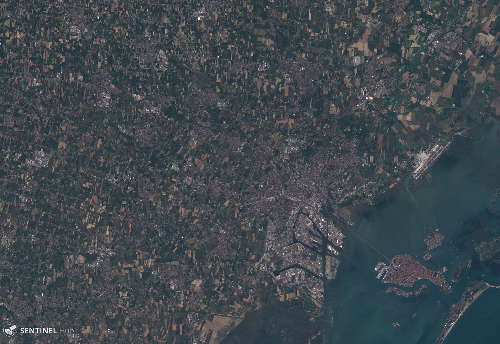
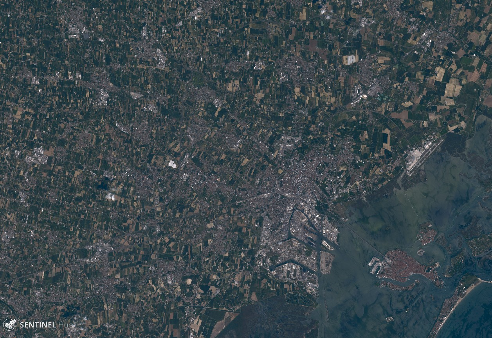

# Natural color representation of Sentinel-2 data

This repository contains supplementary material for our paper:

&nbsp;&nbsp;&nbsp;&nbsp; B. Sovdat, M. Kadunc, M. Batič, G. Milčinski, _Natural color representation of Sentinel-2 data_. Submitted.

## Introduction

The true color image &mdash; defined as an image that strives to offer a natural color rendition of a scene &mdash; is one of the most widely used [Earth observation](https://en.wikipedia.org/wiki/Earth_observation) products. In the context of satellite imagery, the true color should represent spectral responses of the satellite bands so as to match the color perceived by the human eye. However, most true color satellite products fail to achieve this.

When it comes to [Sentinel-2](https://sentinel.esa.int/web/sentinel/missions/sentinel-2) &mdash; an optical mission part of [European Space Agency](http://www.esa.int/ESA)'s [Copernicus Program](http://www.esa.int/Our_Activities/Observing_the_Earth/Copernicus) &mdash; the state-of-the-art true color products map [Sentinel-2 MSI](https://earth.esa.int/web/sentinel/technical-guides/sentinel-2-msi/msi-instrument) bands B4, B3, and B2 directly to [sRGB](https://en.wikipedia.org/wiki/SRGB) components R, G, and B, respectively (sometimes with additional gain and gamma corrections in the sRGB space). This results in images with overly saturated and sometimes unrealistic colors.

Highlights of our contributions:
* We define the natural color product as the one matching the color perceived by the human eye.
* We propose two approaches for designing efficient algorithms for computing natural color.
* We implement and demonstrate several efficient algorithms for computing the natural color.
* We advocate correct sRGB encoding when preparing images for digital display.
* We urge that levels adjustment always be applied in the CIE LAB space.

The images below showcase the default true color (left) and the natural color (right) that we propose in our work.

True color | Natural color
:---------:|:-------------:
 Carrizo Plain National Monument |  Carrizo Plain National Monument
 Izmir, Turkey |  Izmir, Turkey
 Amposta, Spain |  Amposta, Spain
 Venice, Italy |  Venice, Italy

### List of locations

The table belows is a listing of Sentinel-2 data used throughout the paper. Locations, their acquisition dates and links to  [EO Browser](https://apps.sentinel-hub.com/eo-browser/) where user can reproduce the results from the article using JavaScript algorithms provided in the supplementary material.

Location name | Level | Date | Coordinates | EO Browser
:------------:|:-----:|:----:|:-----------:|:----------:
Mount Bromo (Indonesia) | 1C | August 9, 2016 | 7.96° S 113.00° E | [URL](http://apps.sentinel-hub.com/eo-browser/#lat=-7.964377531436546&lng=112.9960584640503&zoom=14&datasource=Sentinel-2%20L1C&time=2016-08-09&preset=1_TRUE_COLOR)
Sand dunes (Saudi Arabia) | 1C | September 7, 2017 | 19.57° N 48.63° E | [URL](http://apps.sentinel-hub.com/eo-browser/#lat=19.574347451922222&lng=48.62617492675781&zoom=12&datasource=Sentinel-2%20L1C&time=2017-09-07&preset=1_TRUE_COLOR)
Venice (Italy) | 1C | July 3, 2017 | 45.50° N 12.20° E | [URL](http://apps.sentinel-hub.com/eo-browser/#lat=45.49816553360498&lng=12.196369171142578&zoom=12&datasource=Sentinel-2%20L1C&time=2017-07-03&preset=1_TRUE_COLOR)
Carrizo Plain (California, USA) | 1C | March 28, 2017 | 35.05° N 120.00° W | [URL](http://apps.sentinel-hub.com/eo-browser/#lat=35.05&lng=-119.89999999999998&zoom=12&datasource=Sentinel-2%20L1C&time=2017-03-28&preset=1_TRUE_COLOR)
Amposta (Spain) | 1C | August 4, 2017 | 40.67° N 0.58° E | [URL](http://apps.sentinel-hub.com/eo-browser/#lat=40.670222795307346&lng=0.5790138244628906&zoom=12&datasource=Sentinel-2%20L1C&time=2017-08-04&preset=1_TRUE_COLOR)
Izmir (Turkey) | 1C | September 7, 2017 | 38.54° N 27.08° E | [URL](http://apps.sentinel-hub.com/eo-browser/#lat=38.53903559101298&lng=27.077178955078125&zoom=11&datasource=Sentinel-2%20L1C&time=2017-08-31&preset=1_TRUE_COLOR)
Venice (Italy) | 2A | July 3, 2017 | 45.50° N 12.20° E | [URL](http://apps.sentinel-hub.com/eo-browser/#lat=45.49816553360498&lng=12.196369171142578&zoom=12&datasource=Sentinel-2%20L2A&time=2017-07-03&preset=1_TRUE_COLOR)
Amposta (Spain) | 2A | August 4, 2017 | 40.67° N 0.58° E | [URL](http://apps.sentinel-hub.com/eo-browser/#lat=40.670222795307346&lng=0.5790138244628906&zoom=12&datasource=Sentinel-2%20L2A&time=2017-08-04&preset=1_TRUE_COLOR)

## Interactive examples

You can try out the algorithms we've proposed via [Sentinel Playground](apps.sentinel-hub.com/sentinel-playground/) and [EO Browser](apps.sentinel-hub.com/eo-browser/) applications which run atop our interactive [Sentinel-Hub](http://sentinel-hub.com/) platform.

All natural-color algorithms have been implemented as ready-to-use custom scripts (under `./scripts/`) that you can copy-and-paste into Sentinel Playground and/or EO Browser. Needless to say, you can also fiddle with the code!

For convenience we've collected the algorithms into a table with links where you can view them interactively in Sentinel Playground and/or EO Browser.

### List of procedures

The table below summarizes each of the procedures used in the paper.

Procedure | Shorthand description | Custom script
:---:|:------------------:|:------:|
I | `DN -> sRGB` | [`true_color.js`](./scripts/true_color.js)
II | `DN -> S2 -> sRGB*_lin -> sRGB_8bit` | [`aster_3x4_naive_gamma.js`](./scripts/aster_3x4_naive_gamma.js)
III | `DN -> S2 -> XYZ -> LAB* -> XYZ -> sRGB_lin -> sRGB_8bit` | [`aster_3x4_proper_gamma.js`](./scripts/aster_3x4_proper_gamma.js)
IV | `DN -> S2 -> XYZ -> sRBG_lin -> sRGB_8bit` | [`aster_3x4_no_gamma`](./scripts/aster_3x4_no_gamma.js)
V | `DN -> S2 -> XYZ -> sRGB*_lin -> sRGB_8bit` | [`aster_3x3_naive_gamma_I.js`](./scripts/aster_3x3_naive_gamma_I.js)
VI | `DN -> S2 -> XYZ -> sRGB*_lin -> sRGB_8bit` | [`aster_3x3_naive_gamma.js`](./scripts/aster_3x3_naive_gamma.js)
VII | `DN -> S2 -> XYZ -> LAB* -> XYZ -> sRGB_lin -> sRGB_8bit` | [`aster_3x3_proper_gamma.js`](./scripts/aster_3x3_proper_gamma.js)
VIII | `DN -> S2 -> XYZ -> sRGB_lin -> sRGB_8bit` | [`aster_3x3_no_gamma.js`](./scripts/aster_3x3_no_gamma.js)
IX | `DN -> S2 -> XYZ -> sRGB*_lin -> sRGB_8bit` | [`basis_3x4_naive_gamma.js`](./scripts/basis_3x4_naive_gamma.js)
X | `DN -> S2 -> XYZ -> LAB* -> XYZ -> sRGB_lin -> sRGB_8bit` | [`basis_3x4_proper_gamma.js`](./scripts/basis_3x4_proper_gamma.js)
XI | `DN -> S2 -> XYZ -> sRGB_lin -> sRGB_8bit` | [`basis_3x4_no_gamma.js`](./scripts/basis_3x4_no_gamma.js)
XII | `DN -> S2 -> XYZ -> sRGB*_lin -> sRGB_8bit` | [`default_3x3_naive_gamma.js`](./scripts/default_3x3_naive_gamma.js)
XIII | `DN -> S2 -> XYZ -> LAB* -> XYZ -> sRGB_lin -> sRGB_8bit` | [`default_3x3_proper_gamma.js`](./scripts/default_3x3_proper_gamma.js)
XIV | `DN -> S2 -> XYZ -> sRGB_lin -> sRGB_8bit` | [`default_3x3_no_gamma.js`](./scripts/default_3x3_no_gamma.js)

## Data
We used the [ASTER spectral library](https://speclib.jpl.nasa.gov/) extensively for our experiments. The file [`used_aster_spectra.txt`](./data/used_aster_spectra.txt) contains the list of ASTER spectra used for fitting the mappings with least-squares method (described in detail in Subsection 2.1 of the paper).
